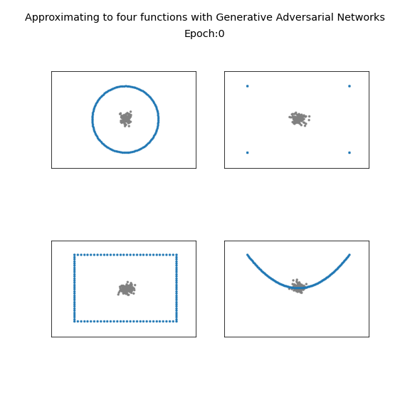

# gen-adv-net
Generative adversarial Networks

This Jupyter Notebook provides you an adapted version of the implementation of Generative Adversarial Networks (GAN) on the tensorflow.org for four different functions: square, $x^2$, circle, and a function that only returns four points. This GAN example is developed after seeing a very similar example which was developed by Grégoire Delétang (see  [this](https://towardsdatascience.com/how-gans-really-work-2e1db1f407bb)). So credit goes to Grégoire Delétang.

I prepared this for educational purposes and I would like to here from you to implement similar examples :).

This example generates the animated GIF named "000_merge-2.gif", which is also shown below. The GIF files of four functions are also added. Please see circle.gif, x2.gif, fourpoints.gif, and square.gif.





If you want to visualize a new function you need to change the code fragment below:

```python
#generate a dataset whose elemnts are one of [[1,1],[-1,1],[-1,-1],[1,-1]]
fourpoints_set = tf.tile(tf.constant([[1,1],[-1,1],[-1,-1],[1,-1]]), [TRAINING_SIZE//8,1])

#generate a dataset whose elemnts are points of a circled centered at (0,0)
pi_ = tf.reshape(tf.linspace(-np.pi,np.pi,TRAINING_SIZE//2),[TRAINING_SIZE//2,1])
circle_set = tf.concat([tf.cos(pi_),tf.sin(pi_)], -1)

##generate square with corners [[1,1],[-1,1],[-1,-1],[1,-1]]
line_size=TRAINING_SIZE//8
square_upline_lr = tf.stack([tf.linspace(-1.,1.,line_size),tf.constant([1.0]*line_size)],axis=-1)
square_rightline_tb = tf.stack([tf.constant([1.0]*line_size),tf.linspace(1.,-1.,line_size),],axis=-1)
square_botline_rl = tf.stack([tf.linspace(1.,-1.,line_size),tf.constant([-1.0]*line_size)],axis=-1)
square_leftline_bt = tf.stack([tf.constant([-1.0]*line_size),tf.linspace(-1.,1.,line_size),],axis=-1)
square_set = tf.concat([square_upline_lr,square_rightline_tb,square_botline_rl,square_leftline_bt],axis=0)

#generate a dataset whose elemnts are points of a circled centered at (0,0)
x2 = tf.reshape(tf.linspace(-1.,1.,TRAINING_SIZE//2),[TRAINING_SIZE//2,1])
x2_set = tf.concat([x2,tf.constant(x2**2)], -1)


datasets = {
    "fourpoints":fourpoints_set,
    "circle":circle_set,
    "square":square_set,
    "x2":x2_set
}

train_dataset_name="circle"
training_set = datasets[train_dataset_name]
train_dataset = tf.data.Dataset.from_tensor_slices(tf.reshape(training_set, [1,16,16,1])).shuffle(BUFFER_SIZE).batch(BATCH_SIZE)
```

Each dataset above contains 128 datapoints with two dimensions. If you want to add a new data set, just add a new one with the same dimensions, or you can also customize it according to your purposes and change the whole dimensions too!.

You will need to change the paths of some files, and I believe that you can do it by your own, no need to say anythin about that :) 
If you want to see more examples,  is a cool place to start, and dont forget to read the paper below to understand the basics of GAN.

[1] I. Goodfellow, J. Pouget-Abadie, M. Mirza, B. Xu, D. Warde-Farley, S. Ozair, A. Courville, and Y. Bengio. Generative adversarial nets (2014), NIPS 2014.

Best!

Best!
